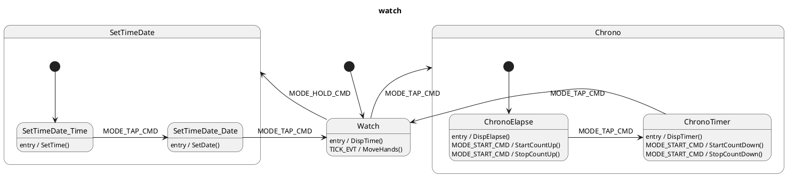

> The MIT License (MIT)
>
> Copyright (c) 2015-2019 Howard Chan
> https://github.com/howard-chan/HSM
>
> Permission is hereby granted, free of charge, to any person obtaining a copy
> of this software and associated documentation files (the "Software"), to deal
> in the Software without restriction, including without limitation the rights
> to use, copy, modify, merge, publish, distribute, sublicense, and/or sell
> copies of the Software, and to permit persons to whom the Software is
> furnished to do so, subject to the following conditions:
>
> The above copyright notice and this permission notice shall be included in all
> copies or substantial portions of the Software.
>
> THE SOFTWARE IS PROVIDED "AS IS", WITHOUT WARRANTY OF ANY KIND, EXPRESS OR
> IMPLIED, INCLUDING BUT NOT LIMITED TO THE WARRANTIES OF MERCHANTABILITY,
> FITNESS FOR A PARTICULAR PURPOSE AND NONINFRINGEMENT. IN NO EVENT SHALL THE
> AUTHORS OR COPYRIGHT HOLDERS BE LIABLE FOR ANY CLAIM, DAMAGES OR OTHER
> LIABILITY, WHETHER IN AN ACTION OF CONTRACT, TORT OR OTHERWISE, ARISING FROM,
> OUT OF OR IN CONNECTION WITH THE SOFTWARE OR THE USE OR OTHER DEALINGS IN THE
> SOFTWARE.

# Example HSM model for a camera

This is a sample markdown document with PlantUML syntax embedded in the document

It is possible that a state is added within the sub-state, but it should not be assigned a parent until a "state" has been found

```puml

<!---
@startuml camera_hsm.png
title Camera
scale 800 width
hide empty description

note top of Camera
    <<include>>
    #include <stdio.h>
end note

note top of Camera
    <<code>>
    void EnterLowPower(void) { printf("\tEnter Low Power Mode\n"); }
    void ExitLowPower(void) { printf("\tExit Low Power Mode\n"); }
    void OpenLens(void) { printf("\tOpen Lens\n"); }
    void CloseLens(void) { printf("\tClose Lens\n"); }
    void BeepLowBattWarning(void) { printf("\tBeep LowBatt Warning\n"); }
    void EnableSensor(void) { printf("\tEnable Sensor\n"); }
    void DisableSensor(void) { printf("\tDisable Sensor\n"); }
    void OpenViewFinder(void) { printf("\tOpen ViewFinder\n"); }
    void CloseViewFinder(void) { printf("\tClose ViewFinder\n"); }
    void TakePicture(void) { printf("\tTake Picture\n"); }
    void SaveImage(void) { printf("\tSave Image\n"); }
    void MemoryFull(void) { printf("\tMemory Full\n"); }
    void TurnOnLCD(void) { printf("\tTurn On LCD\n"); }
    void TurnOffLCD(void) { printf("\tTurn Off LCD\n"); }
    void DisplayPicture(void) { printf("\tDisplay Pictures\n"); }
    void DisplayMenu(void) { printf("\tDisplay Menu\n"); }
end note

note top of Camera
    <<test>>
    Camera_t basic;
    void main(void)
    {
        // Instantiate Camera
        Camera_Init(&basic, "Canon");
        // Turn on the Power
        Camera_Run(&basic, PWR_CMD, 0);
        // Take a picture
        Camera_Run(&basic, RELEASE, (void*)1);
        // Take another picture
        Camera_Run(&basic, RELEASE, 0);
        // Playback the photo
        Camera_Run(&basic, MODE_CMD, 0);
        // Oops, pushed the release button by accident
        Camera_Run(&basic, RELEASE, 0);
        // Go to menu settings
        Camera_Run(&basic, MODE_CMD, 0);
        // Uh oh, low battery
        Camera_Run(&basic, LOWBATT_EVT, 0);
        // Time to turn it off
        Camera_Run(&basic, PWR_CMD, 0);
    }
end note

note "test string" as N

note right of Off : This is a note on a composite state

[*] -> Off
state Off : entry / EnterLowPower();
state Off : exit / ExitLowPower();
Off --> On : PWR_CMD
On --> Off : PWR_CMD
state On : entry / OpenLens();
state On : exit / CloseLens();
state On : LOWBATT_EVT / BeepLowBattWarning();
state On {
    note top of OnShoot
        A note can also
        be defined on
        several lines
    end note
    [*] --> OnShoot
    state OnShoot : entry / \n  EnableSensor();\n  OpenViewFinder();
    state OnShoot : exit / \n   DisableSensor();\n  CloseViewFinder();
    state OnShoot : RELEASE [param > 0] / \n  TakePicture();\n  SaveImage();
    state OnShoot : RELEASE [param == 0] / MemoryFull();
    state OnDisplay : entry / \n  TurnOnLCD();
    state OnDisplay : exit / TurnOffLCD();
    state OnDisplay {
        state OnDisplayPlay : entry / DisplayPicture();
        OnDisplayPlay -> OnDisplayMenu : MODE_CMD
        state OnDisplayMenu : entry / DisplayMenu();
        OnDisplayMenu -> OnShoot : MODE_CMD
        OnShoot -> OnDisplayPlay : MODE_CMD
    }
}

@enduml
--->
```

# Here is another state machine for evaluation

